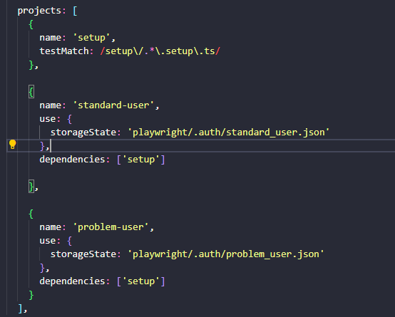

# Introduction

The chosen architecture was the Page Object Model because I am more familiar with it, which will speed up the development process.  
Some recurring components on different pages were also created as [components](/components/), such as **header** and **inventory item**.  
For most of this project, I chose composition over inheritance, reinforcing the decision to separate these elements into components, instead of something like "BasePage".

--- 

# Requirements

- [Node](https://nodejs.org/pt/download), Recommended 22.14 or above
- [NPM](https://github.com/npm/cli), Recommended 9.8.1 or above.

---

# Getting started

#### How to run my tests

1. First, you must run the **"setup"** project. When using the CLI, it runs automatically when needed since I configured it as a dependency for all projects. However, in UI mode, sometimes you may need to manually filter it as well to ensure it runs properly.

2. As we can see in the Playwright configuration (or in the image below), I created two projects besides "setup": "standard-user" and "problem-user". The idea was to simulate two different users with slightly different profiles, both capable of executing all the tested flows. This setup allows us to identify potential unexpected errors that might occur for one user but not for the other, for having different profiles. You can run both projects or just "standard-user" using the following command: `npx playwright test --project standard-user`.



**Note**: There's no problem running the tests as I’ve already configured, one worker per file, and they will run smoothly. However, in a real scenario, some tests might conflict since there is only one actual user available for login. To avoid this, normally is needed to log in with different accounts per worker, or run the tests in serial mode. However, the first option is not possible in SauceDemo web application.

## Project Structure

```plaintext

📦 voidr-challenge
│── 📁 components       # reusable components for composition, representing elements that appear on multiple pages, such as the header, footer, etc.
│── 📁 configuration    # playwright test configuration.
│── 📁 constants        # constant values such page urls and external links.
│── 📁 page-objects     # page objects
│── 📁 resources        # resources like data to use in tests and page texts by language
└── 📁 test-plans       # markdown test plans
└── 📁 tests            # playwright tests
└── 📁 utils            # small and reusable utility functions, such "extract price from string", etc.

```

## Test Results

We can use [playwright report](/playwright-report/index.html) as test result opening with a browser, 
but I also created a document to discuss about test that failed even for "standard_user": [execution-report](/test-plan-execution-report/execution-report-2025-03-21.md)

## Test Plans

[Test plan location](/test-plans/test-plan.md)